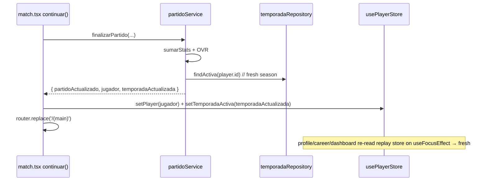

# Design: matchday-polish

## Technical Approach

Five stacked fixes that extend the existing deterministic replay architecture: (0) `finalizarPartido` returns the **fresh season** (re-read via `findActiva`) and `continuar()` calls `setTemporadaActiva` so profile/career/dashboard stay live; (1) persist a nullable `partido.checkpoint_fase` (migration 003) + `guardarCheckpoint`/`findPartidoEnCurso`, rebuild `PartidoEnCurso` from the already-persisted `eventos_json` on resume (overdue abandoned fixtures auto-resolve 3–0 on calendar reconciliation); (2) generalize `PenalTimeline` into `SituacionInteractiva` (6-zone grid, `gol|atajado|palo|afuera|rebote`) with pure deterministic resolvers + `ShotTargetGrid` (`react-native-svg`), retiring the legacy `/penalty` plane; (3) per-club identity via `club-colors.ts` (seed-coherent, seed untouched) + a `useAccentColors()` hook + procedural `ClubCrest`; (4) soft hairline token + an audit of non-`ScreenContainer` screens against safe-area insets (SDK 57 `useSafeAreaInsets` verified). Maps to proposal; satisfies all 7 delta specs.

## Architecture Decisions

| # | Decision | Choice | Alternatives | Rationale |
|---|----------|--------|--------------|-----------|
| D1 | Live-stats combination location | Pure domain helper `carrer.ts:lineaCarreraConActiva(etapas, temporadaActiva)` (`anioFin===null` → sum settled + in-flight); career/profile/dashboard refetch via `useFocusEffect` | Combine in a service, component, or hook | Career already reads `historial_carrera` in-screen; addition is pure arithmetic → domain helper keeps it testable, screens add a the `useFocusEffect` reload only; avoids per-screen tearing logic (live-stats R: live career line) |
| D2 | Pause persistence | New nullable `checkpoint_fase` column (migration 003) + repo methods; rebuild from persisted `eventos_json` | Persist the whole `PartidoEnCurso` session; zustand `persist` | Timeline is already the D1 source of truth; a tiny nullable mark avoids re-serialize of full session and stays additive/reversible; wrap at start + halftime, clear on `finalizarPartido` (paused-match R1/R2) |
| D3 | 3–0 auto-resolve hook | `calendarService.resolverPendientesVencidos(temporadaId)` — finds abandoned (`checkpoint_fase NOT NULL`, `jugo=0`, `fecha_ts < now`) fixtures, marks 3–0, clears checkpoint; invoked from dashboard `cargar()` | Hook in `avanzar`/season-service fixture regen | Fixture dates are wall-clock anchored (real time, no advance button); reconciliation on dashboard load is lazy, idempotent and matches "never resumed" (paused-match R6) |
| D4 | 6-zone determinism | Pure `SituacionInteractiva` with a precomputed `ladoDefensor` zone; outcome is a pure function of `(zonaElegida, ladoDefensor, tipo)`; never re-simulates | Re-derive from seed per trigger | Reuses the existing precompute pattern; deterministic by construction (penalty spec R2 / interactive R2); ≤2 situations (1 pénal + 1 TL, unique minutes) enforced in `simularPartido` |
| D5 | Dynamic accent resolution | `presentation/theme:useAccentColors()` — reads player club → `coloresDeClub` → `{ accent: primario, onAccent: colorTextoDe }`, white fallback; applied to interactive/prominent surfaces only | Per-screen hardcoded hex; mutate static `tokens.ts` at runtime | `tokens.ts` is a static const (non‑reactive); spec forbids per-screen hardcoded accents → one shared hook centralizes resolution; onboarding screens keep static white (correct pre-club). Semantics stay fixed (club-identity R4/R5) |
| D6 | Legacy `/penalty` | **RETIRE** — delete `penalty.tsx`, remove `navegarA:'penalty'` push in `event.tsx`, drop `penal-decision` event + `eventService.resolverPenal`/`patearPenal` after grep-first confirmation | Keep both in parallel | Interactive replay supersedes the narrative plane; keeping it is dead code + double penalty system (proposal intent) |

## Data Flow & Sequence Diagrams

**S0 — Live stats refresh after `continuar()`:**


**S1 — Resume rebuild (checkpoint phase) → `/match`:**
```mermaid
sequenceDiagram
  participant D as dashboard cargar()
  participant R as partidoRepository
  participant S as partidoService (reanudarPartido)
  participant St as usePartidoEnCursoStore
  participant M as match.tsx
  D->>R: findPartidoEnCurso(temporadaId) // eventos_json NOT NULL AND jugo=0
  R-->>D: partido + checkpoint_fase
  Note over D: banner → 'Reanudar' (primer_tiempo) | 'Comenzar 2º Tiempo' (entretiempo)
  D->>S: reanudarPartido(player, temporada, partido, clubRival, fase)
  S-->>S: lineaTiempo = parse(eventos_json)  // NO sim, NO energy charge
  S-->>D: sesion{...,lineaTiempo, checkpointFase}
  D->>St: fijar(sesion); router.push('/match')
  St-->>M: sesion.checkpointFase → relojRef = 0 | DURACION_1T
  M->>M: precompute visibles 1T, descansoHechoRef=true (skip descanso) if 2T resume
```

**S1 — 3–0 auto-resolve on calendar advance:**
```mermaid
sequenceDiagram
  participant D as dashboard useFocusEffect → cargar()
  participant C as calendarService
  participant R as partidoRepository
  D->>C: resolverPendientesVencidos(temporadaId)
  C->>R: findVencidosConCheckpoint() // checkpoint NOT NULL, jugo=0, fecha_ts < now
  R-->>C: [abandoned fixtures]
  loop each
    C->>R: marcarJugado(id,'0-3',0,0,{resuelto:'3-0'}) + limpiarCheckpoint(id)
  end
  C-->>D: done (idempotent; re-run safe)
```

**S2 — Interactive situation resolution (user vs precomputed side):**
```mermaid
sequenceDiagram
  participant Re as replay clock (match.tsx)
  participant R as pure resolver
  participant G as ShotTargetGrid
  participant St as store (lineaTiempo)
  Re->>Re: crossing evento tipo penal|tiro-libre-interactivo && situacion.interactivo && !resultado
  Re->>G: pause → render 6-zone grid + theme colors
  alt User picks within window
    G-->>Re: onAprueba(zona: ZonaDisparo)
    Re->>R: resolverPenalConEleccion | resolverTiroLibreConEleccion(linea, minuto, zona)
    R-->>Re: timeline' (determinístico por ladoDefensor precomputado)
    Re->>Re: feedback 0.6–0.8s (ball→zona, keeper→precomputed side, result color/icon)
    Re->>St: actualizarLineaTiempo(timeline'); persiste via guardarLineaTiempo
  else timeout (inaction default)
    Re->>R: resolverInaccion(timeline) // miss/fell
  end
  Re->>Re: resume clock at next minute
```

## Slice detail + Migration 003

**Migration 003 — `src/data/db/migrations/003-checkpoint.ts`** (add to `MIGRACIONES`, **`VERSION_ACTUAL` auto→3** via array length):
```sql
-- Additive, nullable, no data rewrite. Values: 'primer_tiempo' | 'entretiempo_o_segundo' | NULL.
ALTER TABLE partido ADD COLUMN checkpoint_fase TEXT;
-- Rollback (SQLite >= 3.35, RN SQLite):
-- ALTER TABLE partido DROP COLUMN checkpoint_fase;
```
Existing rows default `NULL` (valid, spec R1 "existing games unaffected"). Mapper `filaToPartido` reads the column (optional) → `Partido.checkpointFase`.

**Repository (`partido-repository.ts`):** `guardarCheckpoint(id, fase)` · `limpiarCheckpoint(id)` · `findPartidoEnCurso(temporadaId)` (`jugo=0 AND eventos_json IS NOT NULL LIMIT 1`) · `findVencidosConCheckpoint(temporadaId)` (`checkpoint_fase NOT NULL AND jugo=0 AND fecha_ts < ?`).

**match.tsx checkpoint writes:** replay-start effect → `guardarCheckpoint(id,'primer_tiempo')`; existing halft-time crossing block (`t>=DURACION_1T`) → `guardarCheckpoint(id,'entretiempo_o_segundo')`; `finalizarPartido` clears (`limpiarCheckpoint`) so headless Copero also un-clutters. Resume clock = `sesion.checkpointFase==='entretiempo_o_segundo' ? DURACION_1T : 0`.

**Error-state rule (from 3-0 + resume):** resume never calls `iniciarPartido` (`consumirEnergia:false` path would still be a full re-entry) — the dedicated `reanudarPartido` builds purely from persisted timeline: **energy charged once, never re-charged** (paused-match R5).

**Slice 4 — Safe area (SDK 57 verified):** `SafeAreaView` already used by `ScreenContainer` and `match.tsx` (`edges:['top','bottom']`). Confirmed via docs (`/sdk/safe-area-context`): `useSafeAreaInsets()` for manual insets; JS `Tabs` auto-applies bottom inset → real risk = absolute overlays (penal grid, scorecard, resume/banner) and `match.tsx` bottom controls. Those switch to `paddingBottom: insets.bottom` via `useSafeAreaInsets`. Hairline: central `tokens.ts` change `border: '#2A2A2A' → 'rgba(255,255,255,0.06)'` (single source → screen-container footer `borderTopColor`, `(main)/_layout.tsx` tab `borderTopColor`, card `borderColor` all follow); keep `borderStrong` for emphasis.

## Interfaces / Contracts

```ts
// partido.ts
export type ZonaDisparo = 'arriba-izquierda'|'arriba-centro'|'arriba-derecha'
                        |'abajo-izquierda'|'abajo-centro'|'abajo-derecha';
export type ResultadoSituacion = 'gol'|'atajado'|'palo'|'afuera'|'rebote';
export interface SituacionInteractiva {
  interactivo: boolean;
  ladoDefensor?: ZonaDisparo;          // zona cubierta gk (penal) o barrera (TL)
  resultado?: ResultadoSituacion;      // undefined = pending interactivo
}
// EventoTimeline: `penal?:` → `situacion?: SituacionInteractiva`; TipoEvento += 'tiro-libre-interactivo'
export function resolverPenalConEleccion(linea: EventoTimeline[], minuto: number, zona: ZonaDisparo): EventoTimeline[];
export function resolverTiroLibreConEleccion(linea: EventoTimeline[], minuto: number, zona: ZonaDisparo): EventoTimeline[];
// resolverTiroLibre: aim low/center (última fila) + barrera cubre → 'rebote'; else zone-vs-gk

// partidoService.ts
export interface ResultadoPartidoJugado { /* + */ temporadaActualizada: Temporada }
export interface PartidoEnCurso { /* + optional */ checkpointFase?: 'primer_tiempo'|'entretiempo_o_segundo'|null }
export function reanudarPartido(player, temporada, partido, clubRival, fase): Promise<PartidoEnCurso>;

// career.ts (pure)
export function lineaCarreraConActiva(etapas: HistorialEtapa[], activa: Temporada | null): LineaCarreraEtapa[];

// club-colors.ts
interface ColoresClub { primario: string; secundario: string }
export const CLUB_COLORS: Record<string, ColoresClub>;  // keyed by slug(nombre) | escudoKey
export function coloresDeClub(club: Pick<Club,'escudoKey'|'nombre'> | null): ColoresClub;

// theme/use-accent.ts
export function useAccentColors(): { accent: string; onAccent: string }; // white fallback
```

## Delivery mapping (5 chained PRs → main in order)

Guard: `Decision needed before apply: Yes` · `Chained PRs: Yes (stacked-to-main)` · `400-line budget: Medium-High`

| Slice | PR | Units | Est. Δ |
|-------|----|-------|--------|
| **0** Live stats | 1 | partidoService (return fresh season), match continuar `setTemporadaActiva`, `carrer.ts` helper, career/profile `useFocusEffect`, dashboard `cerrar()` simplify (drop `findActiva` re-read) | ~180 |
| **1** Paused match | 2 | migration 003, repo checkpoint+find methods, mapper, `reanudarPartido`, match checkpoint writes + resume init, dashboard resume banner + `paused-match-banner.tsx`, `resolverPendientesVencidos` | ~350 |
| **2** Interactive situations | 3 (split 3a/3b/3c each ≤400) | **3a** partido.ts: `SituacionInteractiva`, 6 zones, `ladoDefensor` precompute, ≤2-situation scheduling, `resolverTiroLibreConEleccion`, `resolverPenalInaccion`→general; **3b** `shot-target-grid.tsx` (svg) + match.tsx (grid, feedback 0.6–0.8s, general resolver), `resultadoDesdeLineaTiempo`/`contarGoles` audit; **3c** legacy teardown (grep-first) | ~150 / ~250 / ~80 |
| **3** Club identity | 4 | `club-colors.ts`, `useAccentColors`, `club-crest.tsx`; mount dashboard/calendar/club-oferta/match; accent readers on prominent surfaces; semantic contrast review | ~350 |
| **4** Safe area + hairline | 5 | tokens hairline, `useSafeAreaInsets` audit (match/overlays/root index), tab-bar verification | ~120 |

Mitigation: Slice 2 split into 3 autonomous chained PRs (domain → UI+audit → teardown), each ≤250 authored lines; per-slice rollback to main; `npx tsc --noEmit` + `expo lint` gate every PR.

## Testing Strategy

| Layer | What | Approach |
|-------|------|----------|
| Unit (pure) | `resolverPenalConEleccion`/`resolverTiroLibreConEleccion` deterministic: zona=no cubierta → gol; cubierta → atajado/palo/afuera; low/center+barrera → rebote; never re-sim | seam `random` inject; assert same in→same out |
| Unit (pure) | `simularPartido` ≤2 situations, pénal+TL unique minute; `lineaCarreraConActiva` (sum + no double-count); `coloresDeClub` fallback | direct |
| Unit (repo) | migration 003 additive/no-loss on existing rows; `findPartidoEnCurso` filter; `resolverPendientesVencidos` idempotent | repo with in-memory/fresh DB |
| Integration | `finalizarPartido` returns fresh `temporadaActualizada`; resume rebuild no energy charge; checkpoint cleared on finalize | service + repo |
| E2E/manual | resume (1T + 2T points), 3–0 auto-resolve, 6-zone feedback, crest+accent on all surfaces, no control under gesture bar | Expo Go Android 15/16 |

Verification gate: `npx tsc --noEmit` + `expo lint` (strict_tdd false).

## Threat Matrix

`N/A` — no routing/shell/subprocess/VCS-PR/executable-classification/process-integration boundary. (In-app `expo-router` navigation and typedRoutes regen are UI, not a shell boundary.)

## Migration / Rollout

Migration 003 is additive and reversible (DROP column); VERSION_ACTUAL→3. Slice 2 (interactive situations) touches the timeline shape (`penal`→`situacion`): the persisted `eventos_json` from previous saves still parses because `situacion?.` is optional and old entries carry no `situacion` → legacy penalty events render as non-interactive; determinism audits keep the scorecard safe. Rollback per slice to `main`; teardown Git-recoverable.

## Risks

| Risk | Likelihood | Mitigation |
|------|-----------|------------|
| `resultadoDesdeLineaTiempo` breaks on generalized `situacion` (audit) | High | Audit all `tipo==='penal'` filters in partido.ts + match.tsx `contarGoles/golesDe`; optional field keeps old saves parseable; determinism unit tests |
| Dangling `resolverPenal`/`patearPenal` after teardown | Med | `grep -r penalty src/app` + `grep patearPenal|resolverPenal` before delete; tsc catches stragglers |
| Dynamic accent reduces contrast | Med | Semantics fixed; `colorTextoDe` luminance helper drives `onAccent`; contrast review on all accent surfaces (Slice 4 gate) |
| Checkpoint/migration corrupts games | Med | Nullable additive; resume falls back to null → 0 clock; no energy re-charge; idempotent reconciliation |
| 400-line budget exceeded (Slice 3) | High | Slice 2 split into 3 small chained PRs; per-slice verify gate |

## Open Questions

- [ ] Scope of dynamic accent: apply `useAccentColors` to prominent interactive surfaces only (dashboard/match/career/profile/button/banner); onboarding pre-club screens keep static white — confirm this satisfies "components that already read `colors.accent` use the dynamic value" without a 41-site refactor.
- [ ] 3–0 auto-resolve scope: design scopes it to started-but-abandoned fixtures (`checkpoint_fase NOT NULL`). Confirm not to also auto-resolve never-started fixtures whose date passed (would penalize normal pacing).
- [ ] `EventoTimeline.penal → situacion` rename is a shape break within Slice 3; confirm old saves only need graceful (optional) handling, not a migration of `eventos_json`.